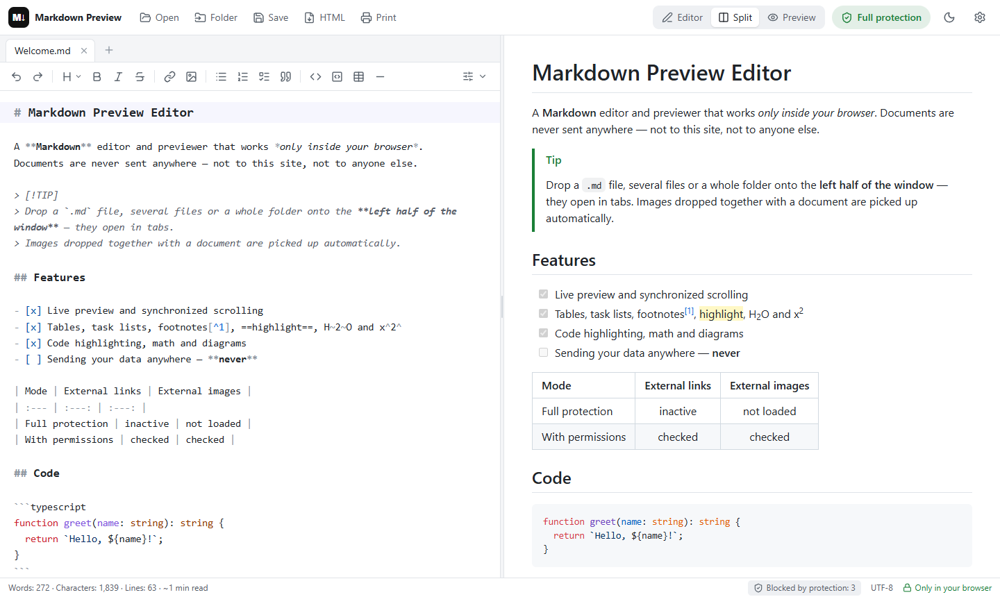

# Markdown Preview Editor

**A self-hosted Markdown editor and live previewer where your documents never leave the browser.**

A static website you host yourself. Everything is processed locally in the browser: there is no backend, no analytics and no CDN. A strict Content-Security-Policy forbids the page from sending data anywhere.

## Features

- Live preview with synchronized scrolling, light and dark themes, mobile layout.
- GitHub-flavored Markdown, code highlighting, math (KaTeX) and diagrams (Mermaid).
- Tabs: work with several documents at once, each with its own undo history; links between open `.md` files switch tabs.
- Drag & drop onto the editor: several files, whole folders, images dropped together with a document.
- Formatting toolbar with a collapsible *Advanced editor* row.
- Save as `.md`, export to self-contained HTML, print or save as PDF.
- 15 interface languages, picked from your browser settings and switchable in Settings: English, Deutsch, Español, Français, Italiano, Português, Nederlands, Svenska, Polski, Українська, Русский, Türkçe, 日本語, 한국어, 简体中文. Each language loads only when it is used.

## Privacy & safety

- The rendered document is shown in a sandboxed frame where scripts cannot run, and it is sanitized with DOMPurify.
- **Full protection** is on by default: external images, media and links are not loaded or followed. You can allow them one by one.
- Allowed links and media go through a lightweight offline check that flags phishing tricks, look-alike domains, executables and local-network addresses. It is a set of heuristics, not an antivirus.

## Installation

Build once with `npm ci && npm run build`, then choose how to serve it:

- **Your website** — extract `release/markdown-preview-editor-site.tar.gz` (or `.zip`) into your site's folder on any static hosting. The included `.htaccess` enables HTTPS and security headers on Apache/LiteSpeed.
- **Docker** — `docker compose -f deploy/docker-compose.yml up -d --build`, then open http://localhost:8080.
- **nginx** — copy `dist/` to the web root and use [deploy/nginx.conf](deploy/nginx.conf).
- **Caddy** — copy `dist/` to `/srv` and run `SITE_ADDRESS=your.domain caddy run --config deploy/Caddyfile`.
- **Locally** — `npm run dev` and open the printed address.

## License

[MIT](LICENSE)
